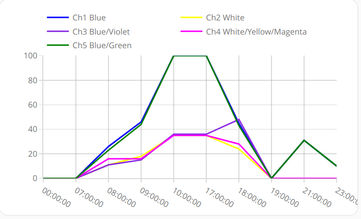
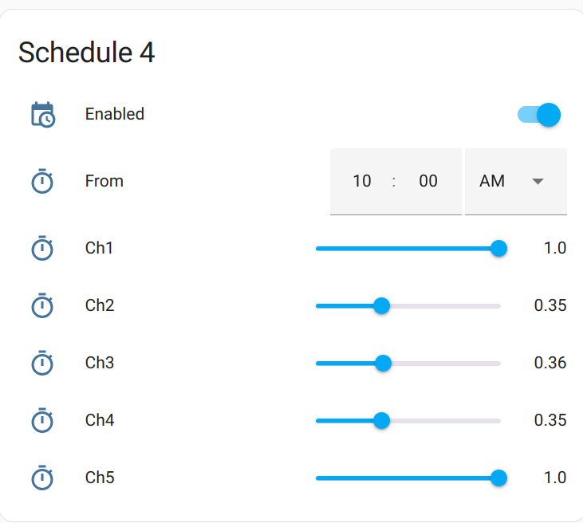

Aquarium Lamp
=============

Project of aquarium lamp based on ESP-32 and [ReefDuino](https://github.com/yoreek/ReefDuino) library with 
control via [Home Assistant](https://www.home-assistant.io/).

General view of the lamp brightness schedule



Setting up a schedule



Configure
---------

### Copy examples of files
```shell
cp src/Config.cpp.example src/Config.cpp
cp src/AquariumLampAppState.cpp.example src/AquariumLampAppState.cpp
```

### Edit src/Config.cpp
Generate certificate for MQTT and put the contents in the file as in the example.

### Edit src/AquariumLampConfig.cpp
Fill in the data for Wifi and MQTT connection (username, password, SSID, etc).
