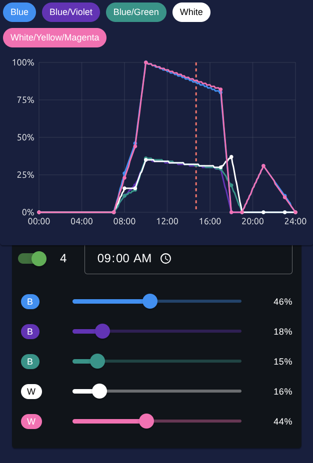

# AquariumLamp

AquariumLamp is an ESP32-based smart lighting controller designed for aquariums.  
It provides flexible configuration with up to 5 independent PWM channels, Wi-Fi connectivity, scheduling, and integration with **Home Assistant** or control via a **Web API**.

A separate Vue.js frontend project is available here: [AquariumLampFrontend](https://github.com/yoreek/AquariumLampFrontend).

## Features

- Control up to **5 PWM channels** (LED channels for aquarium lighting)
- Store and load **settings from EEPROM** (including Wi-Fi, NTP, timezone, and schedule)
- Automatic Wi-Fi setup: connects in STA mode or falls back to AP mode if connection fails
- Full **schedule support** (up to 10 entries with time and brightness per channel)
- **Home Assistant integration** (via MQTT autodiscovery)
- **Web API control** for remote configuration
- **Web-based UI** (from [AquariumLampFrontend](https://github.com/yoreek/AquariumLampFrontend)) hosted on ESP32 using LittleFS

## API

The ESP32 exposes a REST API for managing:

- **Lamp control** (turn on/off, set brightness per channel)
- **Schedule management** (add, edit, delete schedule entries)
- **Wi-Fi configuration** (switch networks, reconnect)
- **Time synchronization** (via NTP and timezone settings)
- **Device info & settings**

## Home Assistant Integration

AquariumLamp integrates with **Home Assistant** via MQTT.  
Each channel and setting is exposed as an entity, making it easy to automate and monitor within HA.

## Installation

1. Flash the firmware to ESP32 using PlatformIO or Arduino IDE.
2. Upload the **AquariumLampFrontend** build to ESP32’s LittleFS storage.
3. Connect to the device via Wi-Fi or configure it to connect to your router.
4. Access the web UI or connect it to Home Assistant.

## Screenshots

### Home Assistant Integration

### Web Application

## License

`yoreek/AquariumLamp` is licensed under the **GNU General Public License v3.0**.  
See the [LICENSE](LICENSE) file for details.